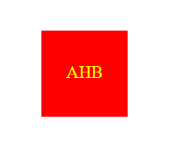

# Brand-Logo-Maker

## Description
A simple logo generator that allows the user to input 3 letters for the brand, text color, shape, and shape color. This application uses Nodejs and inquirer.

## Table of Contents
- [Installation](#installation)
- [Usage](#usage)
- [Preview](#preview)
- [Tests](#tests)
- [License](#license)
- [Questions](#questions)

## Installation
Requires nodejs and inquirer. Clone the repo and then run npm install to install dependencies (inquirer and jest).

## Usage
Run node index.js to start the questions. The file will be saved as logo.svg in the "examples" directory.

## Preview

## Tests
Open intergrated terminal from shapes.test.js and install jest if not done so already (npm install jest --save-dev). Once jest is installed, you can run the test with the command (npx jest).

## License

This project is licensed under the [MIT License](https://opensource.org/licenses/MIT) license.

## Questions
If you have any questions, you can find me on GitHub:

GitHub: [Eveykins86](https://github.com/Eveykins86)

Feel free to reach out via email:

Email: evey.plt@gmail.com